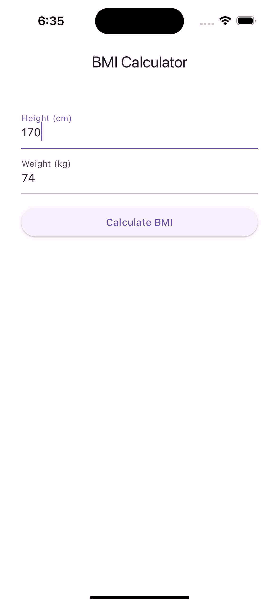
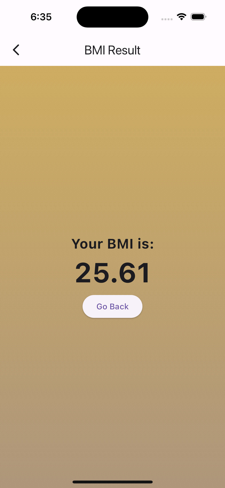

# BMI Calculator App

The BMI Calculator App is a simple Flutter application that allows users to calculate their BMI based on their height and weight.

## Features

- Calculate BMI: Enter your height (in centimeters) and weight (in kilograms) to calculate your BMI instantly.
- View Result: Get instant feedback on your BMI along with a brief interpretation of the result.
- User-Friendly Interface: Simple and intuitive design for easy navigation and usability.

## Screenshots
<p align="center">
  <em>Home Screen</em>
  <br>
  
</p>
<br>
<br>

<p align="center">
  <em>Result Screen</em>
  <br>
  
</p>

## Installation

# Clone the repository
```shell
git clone https://github.com/Vsjangal/BMI_CAL_APP.git
```
# Navigate to the project directory
```shell
cd bmi_calculator
```
# Open the project in your preferred IDE or text editor


## Usage

1. Run the app on an emulator or physical device.
2. Enter your height (in centimeters) and weight (in kilograms) on the input screen.
3. Tap the "Calculate BMI" button to see your BMI result.
4. View the result screen to see your BMI along with a brief interpretation of the result.

## Dependencies

This app is built with Flutter, a cross-platform framework for building mobile applications. No additional dependencies are required.

## Contributing

Contributions are welcome! Please feel free to fork the repository and submit pull requests to suggest improvements or add new features.

## License

This project is licensed under the [MIT License](LICENSE).
